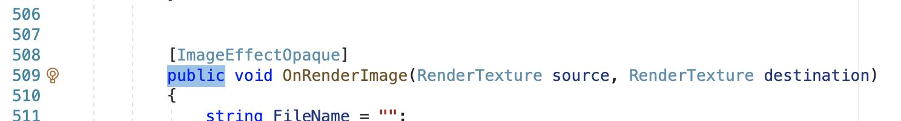
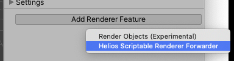
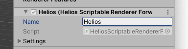

# Helios URP Forwarder

Scriptable Renderer that forwards render data to Helios

1. Make `Helios::OnRenderImage` in **Helios.cs** `public`

  

1. Add **Helios Scriptable Renderer Forwarder** as **Renderer Feature** to Scriptable Pipeline

  

1. Give **Forwarder** a handy name you'll remember
  
  

1. ⚡️